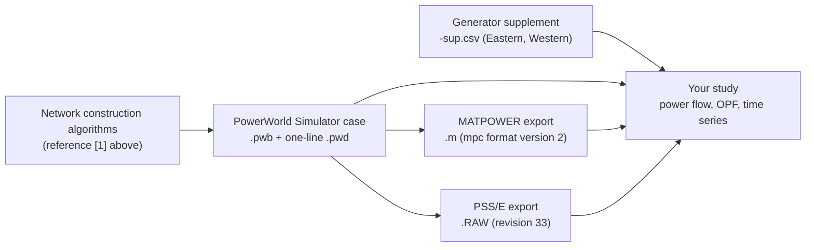

# Synthetic Network Models

These cases are entirely synthetic electric grids that cover various portions of the United States. The synthetic transmission systems were designed by algorithms described in [1] to be statistically similar to actual transmission system models but without modeling any actual transmission lines.

When publishing results based on these grid models, please cite:
[1] J. M. Snodgrass, "Tractable Algorithms for Constructing Electric Power Network Models," Ph.D. Thesis, The University of Wisconsin - Madison, 2021. 

This is a synthetic electric grid model that does not represent the actual grid. It was developed as part of the US ARPA-E GRID DATA research project and contains no CEII.

Copyright (c) 2022 by J. Snodgrass, S. Greene, B. Lesieutre, C. DeMarco
Licensed under the Creative Commons Attribution 4.0 International license, http://creativecommons.org/licenses/by/4.0/

<!-- Sections below were added on 2026-09-27. The original text above is unchanged. -->

## Overview

This repository holds synthetic transmission network cases for seven U.S. regions: the Eastern and Western interconnections, Texas, Florida, a Michigan-Ohio-Indiana (Midwest) footprint, Wisconsin, and a 250-bus New England system. Each region folder has a PowerWorld Simulator case with a one-line diagram, plus MATPOWER (`.m`) and PSS/E (`.RAW`) exports. Use them for power flow, optimal power flow and other studies that need a transmission model statistically similar to real ones but free of CEII. The repository holds data and documents only; there is no code to build or run.

## How it works



The `.m` and `.RAW` files were written by PowerWorld Simulator: each `.m` file starts with "Case saved by PowerWorld Simulator", and each `.RAW` header line names the Simulator version and build date. For every case, the `.m` and `.RAW` files have the same number of buses, generators and branches and the same total load. Pick the format that matches your tool.

## Repository layout

| Folder | What it contains | Main contributor (git history) | Start here |
|---|---|---|---|
| [`Eastern Network/`](Eastern%20Network/README.txt) | Eastern Interconnection case `Base_Eastern_Interconnect_515GW` (`.pwb`, `.m`, `.RAW`), one-line `Eastern Network One-Line.pwd`, generator supplement `Base_Eastern_Interconnect_515GW-sup.csv` | Jonathan Snodgrass | `Base_Eastern_Interconnect_515GW.pwb` |
| [`Florida/`](Florida/README.txt) | Florida case `Base_Florida_42GW` (`.pwb`, `.m`, `.RAW`), `Base_Florida_42GW_PW_Version20.PWB`, one-line `Florida-One-Line.pwd` | Jonathan Snodgrass | `Base_Florida_42GW.pwb` |
| [`Midwest/`](Midwest/README.txt) | Michigan, Ohio and Indiana case `Base_MIOHIN_76GW` (`.pwb`, `.m`, `.RAW`), `Base_MIOHIN_76GW_PW_Verson20.PWB`, one-line `MIOHIN-One-Line.pwd` | Jonathan Snodgrass | `Base_MIOHIN_76GW.pwb` |
| [`New England/`](New%20England/Readme%20New%20England.txt) | 250-bus New England system: PowerWorld, MATPOWER and PSS/E cases for several load levels and two voltage-limit sets, and a case description (see the table below) | Jonathan Snodgrass | `New England 250 Bus System and Case Descriptions.docx` |
| [`Synthetic Generator Cost Curves/`](Synthetic%20Generator%20Cost%20Curves/Creating%20synthetic%20generator%20cost%20curves.pdf) | PDF report "Synthetic Power System, Generator Cost Curves" on deriving constant, linear and quadratic cost coefficients for the generators of a synthetic system. The `Readme.md` in this folder is blank. | Jonathan Snodgrass | `Creating synthetic generator cost curves.pdf` |
| [`Texas/`](Texas/README%20Texas.txt) | Texas case `Base_Texas_66GW` (`.pwb`, `.m`, `.RAW`), `Base_Texas_66GW_PW_Version20.PWB`, one-line `Base_Texas_66GW.pwd`, image `TexasOneLine.png` | Jonathan Snodgrass | `Base_Texas_66GW.pwb` |
| [`Western Network/`](Western%20Network/README%20Western.txt) | Western Interconnection case `Base_West_Interconnect_121GW` (`.pwb`, `.m`, `.RAW`), `Base_West_Interconnect_121GW_PW_Version20.PWB`, one-line `Base_West_Interconnect_121GW.pwd`, generator supplement `Base_West_Interconnect_121GW-sup.csv`, image `WesternOneLine.png` | Jonathan Snodgrass | `Base_West_Interconnect_121GW.pwb` |
| [`Wisconsin/`](Wisconsin/README%20Wisconsin.txt) | Wisconsin case `Wisconsin_1664` (`.PWB`, `.m`, `.RAW`), `Wisconsin_1664_PW_Version20.PWB`, one-line `Wisconsin_1664_OneLine.pwd` | Jonathan Snodgrass | `Wisconsin_1664.PWB` |
| Root files | `README.md` (this file), `LICENSE`, `.gitignore` | Jonathan Snodgrass | `README.md` |

### Case sizes

Counted from the `.m` files; the `.RAW` files give the same counts. Load is the sum of bus real-power demand.

| Folder | Case | Buses | Generators | Branches (lines and transformers) | Load (MW) | DC lines |
|---|---|---:|---:|---:|---:|---:|
| Eastern Network | `Base_Eastern_Interconnect_515GW` | 78,484 | 6,873 | 126,146 | 514,957 | 1 |
| Western Network | `Base_West_Interconnect_121GW` | 20,758 | 2,250 | 33,368 | 120,886 | 0 |
| Midwest | `Base_MIOHIN_76GW` | 10,192 | 722 | 17,043 | 76,525 | 0 |
| Texas | `Base_Texas_66GW` | 7,336 | 686 | 11,521 | 66,286 | 1 |
| Florida | `Base_Florida_42GW` | 5,658 | 474 | 9,078 | 42,383 | 0 |
| Wisconsin | `Wisconsin_1664` | 1,664 | 79 | 2,462 | 10,034 | 0 |
| New England | `BaseCase` and 12 operating points | 250 | 42 | 339 | 9,390 to 24,044 (`BaseCase`: 11,324) | 0 |

### New England folder

| Path (under `New England/`) | Contents |
|---|---|
| `PowerWorld Cases/New England Base Case.PWB`, `PowerWorld Cases/New England One-Line.pwd` | Base case and its one-line diagram |
| `PowerWorld Cases/MasterCase.PWB`, `PowerWorld Cases/MasterCase.tsb` | Master case with voltage-controlled switched shunts. `MasterCase.tsb` holds the hourly load for one week in each season, for Simulator's Time Step Simulation tool. |
| `PowerWorld Cases/Generous Voltage Limits/`, `PowerWorld Cases/Tight Voltage Limits/` | Nine cases each (Fall106, Fall116, Spring4, Spring13, Summer69, Summer90, Summer93, Winter12, Winter68) and a `SystemOneLine.pwd` |
| `PowerWorld Cases/SystemOneLine.pwd` | Another one-line diagram file |
| `MatPower Cases/`, `PSSE Cases/` | `BaseCase` plus 12 cases in `Easy/` (3), `Medium/` (6) and `Hard/` (3). The number in each name is the hour of the week-long load profile; "Generous" or "Tight" names the bus voltage-limit set. |
| `New England 250 Bus System and Case Descriptions.docx` | Voltage-limit sets, generator reactive power limits, shunts, and the recommended algorithms (OPF, security-constrained OPF, unit commitment) for each case |

## Setup

1. Get the files. Clone the repository (`git clone https://github.com/WISPO-POP/SyntheticElectricNetworkModels.git`) or download the files you need one at a time from the GitHub web page. The checked-out files total about 400 MB; the Eastern `.pwb` alone is about 80 MB.
2. Install the tool for the format you want to use:
   - **PowerWorld Simulator** (Windows) for `.pwb`/`.PWB`, `.pwd` and `.tsb` files. Check that your Simulator license allows the case size you open (the Eastern case has 78,484 buses).
   - **MATLAB or GNU Octave with MATPOWER** for `.m` files. Download MATPOWER and run `install_matpower` once so its functions are on the path.
   - **PSS/E**, or another program that reads PSS/E revision 33 raw data, for `.RAW` files. PowerWorld Simulator can also open `.RAW` files.
3. No Python environment is needed. The repository has no code, so there is no `requirements.txt`.
4. There are no hard-coded paths to edit.

## Running

PowerWorld Simulator:

1. **File > Open Case** and pick the region's case, for example `Florida/Base_Florida_42GW.pwb`.
2. **File > Open Oneline** and pick the matching one-line, for example `Florida/Florida-One-Line.pwd`.
3. Switch to Run Mode and solve the power flow (Single Solution).
4. If your Simulator version cannot open the main `.pwb`, try the `_PW_Version20.PWB` file in the same folder. Florida, Midwest, Texas, Western Network and Wisconsin have one (in Midwest it is spelled `Base_MIOHIN_76GW_PW_Verson20.PWB`).
5. New England time series: open `New England/PowerWorld Cases/MasterCase.PWB`, then read `MasterCase.tsb` into the Time Step Simulation tool.

MATPOWER (MATLAB or Octave), starting from the repository root:

```matlab
cd('Florida')                          % folder that holds the .m file
mpc = loadcase('Base_Florida_42GW');   % load the case struct
results = runpf(mpc);                  % AC power flow
results = runopf(mpc);                 % AC optimal power flow using mpc.gencost
```

- The Eastern and Texas cases each include one DC line in `mpc.dcline`. MATPOWER models it only after `mpc = toggle_dcline(mpc, 'on');`.
- New England: `cd('New England/MatPower Cases/Medium')`, then `mpc = loadcase('Fall106Tight');`. Load each case by its file name (see Known issues). The case description states that the three `Hard/` cases are not feasible in the MATPOWER OPF solver.

PSS/E: read the `.RAW` file (for example `Texas/Base_Texas_66GW.RAW`) as power flow raw data, then solve.

## Inputs and outputs

- Inputs: none. Every file is ready to open; nothing here is generated by code.
- `.pwb` / `.PWB`: PowerWorld Simulator case.
- `.pwd`: PowerWorld one-line diagram. Open it after the case.
- `.m`: MATPOWER case function that returns `mpc` (format version 2, 100 MVA base) with `bus`, `gen`, `branch`, `gencost` and `bus_name`. The six regional cases (all but New England) also have `genfuel` and `gentype`. Generator costs use the polynomial model (model 2) and are at most quadratic.
- `.RAW`: PSS/E revision 33 power flow data (100 MVA base, 60 Hz).
- `-sup.csv` (Eastern, Western): one row per generator, keyed by `BusNum` and `GenID`, with `GenFuelType`, `GenUnitType`, `GenIOB`, `GenIOC` and `GenParFac`.
- `.tsb` (New England): time-series load data for `MasterCase.PWB`.
- `.png` (Texas, Western Network): images of the geographic one-line diagram.
- `.docx`, `.pdf`: the New England case description and the generator cost-curve report.

## Known issues

- `New England/PSSE Cases/Medium/Spring4Tight.RAW` has the wrong suffix. It uses the generous bus voltage limits and matches `New England/MatPower Cases/Medium/Spring4Generous.m` (same load and generator dispatch). The case description calls this case "Spring 4 Generous".
- The New England `.m` files declare function names that differ from their file names. For example, `BaseCase.m` declares `MasterCase` and `Summer69Tight.m` declares `summer69_1`. MATLAB uses the file name, so call `loadcase('BaseCase')`, not `loadcase('MasterCase')`. GNU Octave prints a warning about the mismatch.
- The New England case description refers to Excel files (hourly real and reactive load by season, generator reactive power limits, switched shunt capacitor values) that are not in this repository. The hourly load is available in `PowerWorld Cases/MasterCase.tsb`.

## Contributors

From the git history:

- Jonathan Snodgrass: 13 commits

The report in `Synthetic Generator Cost Curves/` names Sogol Babaeinejadsarookolaee as its author.

## Status

- First commit 2022-06-23; last code commit 2026-07-21 (adds `LICENSE`).
- The region case files (`.pwb`, `.m`, `.RAW`, `-sup.csv`) were added on 2022-08-03.
- On 2023-02-01 the six regional PowerWorld cases were re-saved, and the `_PW_Version20.PWB` copies, most one-line `.pwd` files and the region README files were added.
- The `.m` and `.RAW` files have not changed since 2022-08-03, apart from the New England `MasterCase` to `BaseCase` rename on 2023-02-01.
- Later changes to the files now in the repository: the New England base case was updated on 2023-02-17 and 2023-05-19; `TexasOneLine.png` and `WesternOneLine.png` were added on 2025-10-17.
- This is a data release. No code is maintained here.

## Funding / How to cite

Cite reference [1] at the top of this file. The top of this file also states that the models were developed in the US ARPA-E GRID DATA project. Each region README repeats the same reference.
